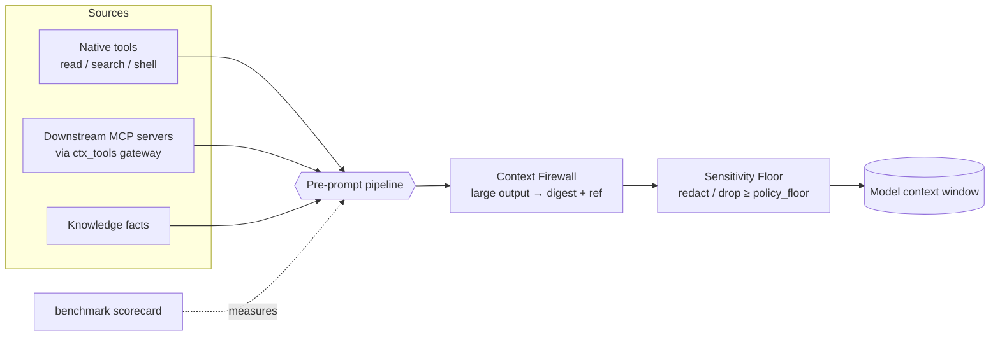

# lean-ctx User Journeys — The Governed, Scalable Context Runtime

> **Audience:** website / product narrative. Each journey is a persona-driven
> story: *who* hits a wall, *what* they do with lean-ctx, *what runs under the
> hood*, and the *payoff*. Every command and config key below is real and shipped
> — copy-paste them.

lean-ctx started as a way to **compress what your agent reads**. This wave turns
it into a **governed, scalable context runtime**: it can sit in front of an
unbounded number of external tools, keep runaway outputs out of the window,
enforce data-sensitivity policy before anything reaches the model, and *prove* its
savings with a reproducible scorecard.

The through-line: **one pre-prompt choke point**. Everything an agent is about to
see — native tool output, downstream MCP results, knowledge facts — passes through
the same pipeline, so the firewall, the sensitivity floor, and the gateway all
compose instead of fighting each other.

| Wave feature | Persona it unblocks | One-line value | Surface |
|---|---|---|---|
| **MCP Tool-Catalog Gateway** | Agent with 5+ MCP servers | Unlimited downstream tools at constant context cost | `ctx_tools`, `[gateway]` |
| **Context Firewall** | Anyone running shell/search through an agent | Runaway outputs become a digest + retrieval ref | `[archive].ephemeral` |
| **Per-item Sensitivity Floor** | Regulated / security-conscious teams | Secrets & PII are redacted or dropped *before* the model | `[sensitivity]` |
| **Reproducible Scorecard** | Buyers, maintainers, CI | Self-verifying proof of savings + retrieval quality | `lean-ctx benchmark scorecard` |

---

## Journey 1 — "My agent is drowning in tools" → MCP Tool-Catalog Gateway

**Persona:** Maya, a platform engineer. Her agent is wired to filesystem, GitHub,
Linear, Postgres and two internal MCP servers. Every request now ships *dozens* of
tool schemas in the system prompt. The agent has gotten **slower, pricier, and
worse at picking the right tool** — the well-documented "more tools → less
adoption" curve.

**The wall:** every connected MCP server injects its *entire* catalog, on every
request, whether or not the task needs it. lean-ctx used to shrink only its *own*
surface; Maya's pain is the *external* surface.

**The journey:**

1. Maya points lean-ctx at her servers — once, globally (this is privileged: it
   can spawn processes and open connections, so it is **never** read from a
   project-local config):

```toml
# ~/.lean-ctx/config.toml
[gateway]
enabled = true
top_n = 5
cache_ttl_secs = 300

[[gateway.servers]]
name = "linear"
transport = "http"
url = "https://mcp.linear.app/mcp"
headers = { Authorization = "Bearer ${LINEAR_TOKEN}" }

[[gateway.servers]]
name = "fs"
transport = "stdio"          # spawned as a child process
command = "mcp-server-filesystem"
args = ["/srv/project"]
```

2. Her agent now sees **one** tool, `ctx_tools`, instead of the whole union. It
   describes the task in natural language:

```jsonc
ctx_tools {"action":"find","query":"open an issue with a title and assignee"}
```

3. lean-ctx returns a ranked shortlist — the few tools that actually matter, plus
   a count of everything it shielded:

```text
gateway: 3 tool(s) for "open an issue" (catalog: 47 tool(s) across 5 server(s))

1. linear::create_issue — Create a Linear issue   params: title*, assignee, team
2. github::create_issue — Open a GitHub issue      params: repo*, title*, body
3. linear::update_issue — Update an existing issue  params: id*, state
```

4. The agent invokes the chosen handle; lean-ctx **proxies** the call to the
   owning server and streams back the result:

```jsonc
ctx_tools {"action":"call","tool":"linear::create_issue",
           "arguments":{"title":"Fix login","assignee":"maya"}}
```

**Under the hood** (`rust/src/core/gateway/`):
- `client.rs` — a real MCP client on the official `rmcp` SDK. `stdio` spawns the
  server; `http` uses streamable-HTTP with custom headers. Every connect/list/call
  is bounded by `call_timeout_secs`; sessions open per-operation and shut down
  cleanly (no orphaned child processes).
- `catalog.rs` — aggregates each server's tools into a namespaced `server::tool`
  catalog behind a **TTL cache**. Per-server errors are surfaced, never hidden.
- `router.rs` — builds an **ephemeral BM25 index** over the catalog per query (the
  same engine as `ctx_search`) and returns the top-N, deterministically.
- `ctx_tools.rs` — gates on config, routes the action, and proxies the call;
  downstream results flow back through the *same* firewall + sensitivity floor as
  native tools.

**Payoff:** Maya can connect *as many* MCP servers as she likes. The model's
per-request tool surface stays flat at one meta-tool, tool-selection accuracy
recovers, and the catalog refreshes itself on a TTL. Full reference:
[Journey 5 §10](reference/05-advanced.md).

---

## Journey 2 — "One `grep` blew up my context window" → Context Firewall

**Persona:** Sam, who lets the agent run `ctx_shell`, `ctx_search` and `ctx_tree`
freely. One `rg` across a monorepo, one noisy build log, and **30k tokens of
output** lands in the window — pushing out the code the agent was actually editing.

**The journey:** Sam does nothing. The firewall is **on by default**. When a
firewallable tool's output crosses the token threshold, lean-ctx stores the full
output out-of-band and returns a compact, deterministic **digest** instead:

```text
[ctx_search output: 31,402 tokens stored]
… head (20 lines) …
… tail (8 lines) …
Retrieve in full: ctx_expand(id="a1b2c3", search="TODO", start_line=…, end_line=…)
```

The agent keeps a small, navigable footprint and can drill into the *exact* slice
it needs with `ctx_expand` — by line range or full-text search across the archive.

**Under the hood** (`rust/src/core/firewall.rs`):
- Scope is deliberately narrow: `ctx_shell`, `ctx_execute`, `ctx_search`,
  `ctx_tree`. **Explicit file reads are never firewalled** —
  `is_protected_read()` makes `ctx_read` / `ctx_multi_read` / `ctx_smart_read`
  the single source of truth for "a read always returns content the agent can
  edit against," honoured by both the firewall and the `reference_results` path.
- The digest is built without an LLM (head/tail or char-bounded excerpt for single
  giant lines) so it is reproducible and cheap.

**Config:**

```toml
[archive]
ephemeral = true             # default on. Env: LEAN_CTX_EPHEMERAL
ephemeral_min_tokens = 4000  # threshold. Env: LEAN_CTX_EPHEMERAL_MIN_TOKENS
```

**Payoff:** runaway outputs can no longer evict the working set, with **zero loss**
— the raw output is one `ctx_expand` away.

---

## Journey 3 — "We can't let secrets reach the model" → Per-item Sensitivity Floor

**Persona:** Dana, security lead at a fintech. Policy is non-negotiable:
credentials and customer PII must never leave the building inside an LLM prompt —
even by accident, even in a stack trace an agent happened to `cat`.

**The journey:** Dana sets a **policy floor** once, globally:

```toml
[sensitivity]
enabled = true               # no-op until set. Env: LEAN_CTX_SENSITIVITY
policy_floor = "confidential" # public < internal < confidential < secret
action = "redact"            # redact (mask spans) | drop (withhold whole item)
```

From then on, every item heading to the model is classified and enforced at the
pre-prompt choke point. With `redact`, a leaked AWS key or card number is masked in
place; with `drop`, the offending item is withheld entirely.

**Under the hood** (`rust/src/core/sensitivity/`):
- Ordered levels `Public < Internal < Confidential < Secret` drive a single
  `level >= floor` comparison.
- **Honest classification only** — no speculative heuristics. Secret-like paths and
  detected secrets → `Secret`; **Luhn-validated** card numbers and **ISO-7064**
  IBANs → `Confidential`. This keeps false positives from silently degrading good
  context.
- One `enforce_text()` entry point is applied uniformly to **tool outputs** and
  **knowledge injection** — including downstream results coming back through the
  gateway (Journey 1).

**Payoff:** a uniform, auditable guarantee that sensitive data is handled *before*
it reaches the model — off by default, so nothing changes for users who don't opt
in. Full reference: [Security & Governance](reference/13-security-and-governance.md).

---

## Journey 4 — "Prove the savings are real" → Reproducible Scorecard

**Persona:** Priya, an engineering manager evaluating lean-ctx. Marketing numbers
don't survive procurement. She wants a measurement she can **re-run and get the
same answer** — on her laptop and in CI.

**The journey:**

```bash
lean-ctx benchmark scorecard          # human-readable
lean-ctx benchmark scorecard --json   # machine-readable artifact
```

She gets compression savings (per mode), retrieval **recall@5 / recall@10 / MRR**,
and latency over a fixed scenario matrix — plus a `determinism_digest`:

```jsonc
{
  "schema_version": 1,
  "tokenizer": "…",
  "determinism_digest": "…",   // fingerprint of the latency-free metrics
  "scenarios": [ /* per-scenario savings + recall + mrr */ ],
  "aggregate": { "avg_savings_pct": …, "avg_recall_at_5": …, "avg_mrr": … }
}
```

**Under the hood** (`rust/src/core/scorecard/`): the corpus is generated
deterministically and retrieval is pure BM25, so the **quality** metrics are
identical run-to-run and machine-to-machine. Latency is reported but deliberately
**excluded** from the digest (it's wall-clock). Two runs of the same code anywhere
produce the same `determinism_digest` — the artifact is **self-verifying**, and CI
uploads it on every build.

**Payoff:** Priya can independently reproduce the headline numbers and diff them
across versions — trust by construction, not by claim.

---

## How it all connects



- The **gateway** widens what can *enter* the pipeline (unbounded external tools)
  without widening the window.
- The **firewall** caps the *size* of anything that enters.
- The **sensitivity floor** caps the *sensitivity* of anything that enters.
- The **scorecard** measures the whole pipeline, reproducibly.

Because they share one choke point, a downstream gateway result is firewalled and
sensitivity-checked exactly like a native one — no feature can be bypassed by
routing around it.

---

## What changed under the hood (engineering summary)

| Feature | New / changed code | Tests | Config / surface |
|---|---|---|---|
| **MCP Gateway** | `core/gateway/{config,client,catalog,router,mod}.rs`, `tools/ctx_tools.rs`, `tools/registered/ctx_tools.rs` | `tests/gateway_e2e.rs` (in-process `rmcp` echo server), gateway unit tests | `[gateway]`, `[[gateway.servers]]`; tool `ctx_tools` (granular surface → **72**) |
| **Context Firewall** | `core/firewall.rs` (`is_protected_read` SSOT, digest builder) | firewall + `archive_expand_tests` | `[archive].ephemeral`, `ephemeral_min_tokens` |
| **Sensitivity Floor** | `core/sensitivity/{mod,classify}.rs`, `enforce_text` choke point | `tests/sensitivity_floor.rs` (8) | `[sensitivity]` (`enabled`, `policy_floor`, `action`) |
| **Scorecard** | `core/scorecard/{mod,scenarios}.rs`, `benchmark scorecard` CLI | `tests/scorecard_determinism.rs` (2) | `lean-ctx benchmark scorecard [--json]` |

**Cross-cutting consistency (this pass):** every "tool count" reference across
README, `ARCHITECTURE.md`, `VISION.md`, guides, comparisons, Discord FAQ,
marketing and skills was reconciled to the runtime SSOT of **72** tools — enforced
by `tests/docs_tool_counts_up_to_date.rs`, which fails CI on drift. The generated
appendices ([MCP tools](reference/generated/mcp-tools.md),
[config keys](reference/generated/config-keys.md)) and the website manifest are
regenerated from code.

---

## Where to go next

- **Full feature reference, as journeys:** [docs/reference/README.md](reference/README.md)
- **The gateway in depth:** [Journey 5 — Advanced & Integrations §10](reference/05-advanced.md)
- **Security surface:** [Journey 13 — Security & Governance](reference/13-security-and-governance.md)
- **Always-current tool list:** [generated MCP tools](reference/generated/mcp-tools.md)
